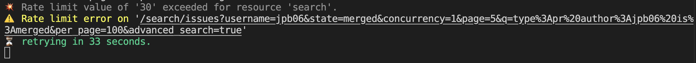

# effect-octokit-layer

[](https://github.dev/jpb06/effect-octokit-layer)


[](https://sonarcloud.io/summary/new_code?id=jpb06_effect-octokit-layer)
[](https://sonarcloud.io/dashboard?id=jpb06_effect-octokit-layer)
[](https://sonarcloud.io/dashboard?id=jpb06_effect-octokit-layer)
[](https://sonarcloud.io/dashboard?id=jpb06_effect-octokit-layer)

[](https://sonarcloud.io/dashboard?id=jpb06_effect-octokit-layer)
[](https://sonarcloud.io/summary/new_code?id=jpb06_effect-octokit-layer)
[](https://sonarcloud.io/summary/new_code?id=jpb06_effect-octokit-layer)
[](https://sonarcloud.io/dashboard?id=jpb06_effect-octokit-layer)
[](https://sonarcloud.io/summary/new_code?id=jpb06_effect-octokit-layer)
[](https://sonarcloud.io/summary/new_code?id=jpb06_effect-octokit-layer)
[](https://sonarcloud.io/dashboard?id=jpb06_effect-octokit-layer)


An [Effect](https://effect.website/) layer to interact with Github Octokit api.

<!-- readme-package-icons start -->

<p align="left"><a href="https://docs.github.com/en/actions" target="_blank"></a>&nbsp;<a href="https://www.typescriptlang.org/docs/" target="_blank"></a>&nbsp;<a href="https://nodejs.org/en/docs/" target="_blank"></a>&nbsp;<a href="https://bun.sh/docs" target="_blank"></a>&nbsp;<a href="https://biomejs.dev/guides/getting-started/" target="_blank"></a>&nbsp;<a href="https://vitest.dev/guide/" target="_blank"></a>&nbsp;<a href="https://www.effect.website/docs/quickstart" target="_blank"></a></p>

<!-- readme-package-icons end -->

## ⚡ Access to github api

You first need to [create a github token](https://github.com/settings/tokens) with a scope related to your needs.

```bash
GITHUB_TOKEN="my-github-token"
```

## ⚡ Layer Api

### 🔶 Layer functions Types

The layer exposes functions with the following type:

```ts
import type { ConfigError, Effect } from 'effect';

type LayerErrors = GithubApiError | ApiRateLimitError | ConfigError.ConfigError;

type LayerFunction<TArgs, TResult> = (
  args: TArgs
) => Effect<TResult, LayerErrors, never>;
```

For example, getting user profile can be done with this function:

```ts
type GetUserProfile = (
  username: string
) => Effect<UserProfileResult, LayerErrors, never>;
```

### 🔶 Users

```typescript
import { Effect, pipe } from 'effect';
import { OctokitLayer, OctokitLayerLive } from 'effect-octokit-layer';

const octokitUser = OctokitLayer.user('jpb06');

const [
  profile,
  repos,
  orgs,
  events,
  commits,
  issues,
  pullRequests,
  userPullRequestsCount,
  userCommitsCount,
  userIssuesCount,
] = await Effect.runPromise(
  pipe(
    Effect.all(
      [
        // Get user profile
        octokitUser.profile(),
        // Get user repos
        octokitUser.repos('all'),
        // Get user organizations
        octokitUser.orgs(),
        // Get user events
        octokitUser.events(),
        // Search in user commits (1000 results max)
        octokitUser.searchCommits(''),
        // Search in user issues (1000 results max)
        octokitUser.searchIssues(''),
        // Search in user merged pull requests (1000 results max)
        octokitUser.searchPullRequests('merged', ''),
        // Get entities count
        octokitUser.getPullRequestsCount('draft'),
        octokitUser.getCommitsCount(),
        octokitUser.getIssuesCount(),
      ],
      // Fetch all these in parallel
      { concurrency: 'unbounded' }
    ),
    Effect.provide(OctokitLayerLive)
  )
);
```

### 🔶 Organizations

```typescript
import { Effect, pipe } from 'effect';
import { OctokitLayer, OctokitLayerLive } from 'effect-octokit-layer';

const orgs = await Effect.runPromise(
  pipe(
    // Get organization repos
    OctokitLayer.org('my-org').repos(),
    Effect.provide(OctokitLayerLive)
  )
);
```

### 🔶 Repositories

```typescript
import { Effect, pipe } from 'effect';
import { OctokitLayer, OctokitLayerLive } from 'effect-octokit-layer';

const octokitRepo = OctokitLayer.repo({
  owner: 'facebook',
  repo: 'react',
});

const [
  languagesBytes,
  releases,
  tags,
  issues,
  issue34,
  issue34Comments,
  pulls,
  pullsComments,
] = await Effect.runPromise(
  pipe(
    Effect.all(
      [
        // Get bytes written per language
        octokitRepo.languages(),
        // Get releases
        octokitRepo.releases(),
        // Get tags
        octokitRepo.tags(),
        // Get all issues which are not pull requests and were created by user 'mcmullinboy15'
        octokitRepo.issues({
          state: 'all',
          excludePulls: true,
          creator: 'mcmullinboy15',
        }),
        // Get issue #34
        octokitRepo.issue(34).details(),
        // Get issue #34 comments
        octokitRepo.issue(34).comments(),
        // Get all pull requests matching head filter 'user:branch-name'
        octokitRepo.pulls.getAll({
          state: 'all',
          sort: 'created',
          direction: 'desc',
          head: 'jpb06:renovate/readme-package-icons-1.x',
        }),
        // Get all pull requests comments in repo
        octokitRepo.pulls.comments(),
      ],
      // Fetch all these in parallel
      { concurrency: 'unbounded' }
    ),
    Effect.provide(OctokitLayerLive)
  )
);
```

### 🔶 Pull requests

```typescript
import { Effect, pipe } from 'effect';
import { OctokitLayer, OctokitLayerLive } from 'effect-octokit-layer';

const pull = OctokitLayer.repo({
  owner: 'facebook',
  repo: 'react',
}).pull(39);

const [details, comments, reviews, createdReview, deletedReview] =
  await Effect.runPromise(
    pipe(
      Effect.all(
        [
          // Pull request details
          pull.details(),
          // All the comments made on the pull request #39
          pull.comments(),
          // Pull request #39 reviews
          pull.reviews.get(),
          // Create a review
          pull.reviews.create({
            event: 'REQUEST_CHANGES',
            body: 'I think some points need to be adressed',
            comments: [
              {
                path: './src/cool.ts',
                body: "Shouldn't this file be renamed",
              },
            ],
          }),
          // Delete review #2
          pull.reviews.delete(2),
        ],
        { concurrency: 'unbounded' }
      ),
      Effect.provide(OctokitLayerLive)
    )
  );
```

### 🔶 Pull request comments

```typescript
import { Effect, pipe } from 'effect';
import { RepoArgs, OctokitLayer, OctokitLayerLive } from 'effect-octokit-layer';

const reactRepo: RepoArgs = {
  owner: 'facebook',
  repo: 'react',
};
const pull = OctokitLayer.repo(reactRepo).pull(39);
const review = pull.review(2593339077);

const [createdComment, comments, deletedComment] = await Effect.runPromise(
  pipe(
    Effect.all([
      // Create a comment in review #2593339077 on pull request #39
      review.comments.create({
        path: './src',
        body: 'cool',
        commitId: 'ff',
      }),
      // Get review #2593339077 comments
      review.comments.get(),
      // Delete comment #1 in review #2593339077
      review.comments.delete(1),
    ]),
    Effect.provide(OctokitLayerLive)
  )
);
```

### 🔶 Parallelism and resilience

#### 🧿 Concurrency

> Default: `10`

You can specify the `concurrency` parameter on calls doing several requests in parallel (paginated data). For example:

```typescript
// Will fetch the first page and then 100 pages concurrently
OctokitLayer.repo({
  owner: 'facebook',
  name: 'react',
}).pulls(100);
```

Note that github api enforces [api rate limits](https://docs.github.com/en/rest/using-the-rest-api/best-practices-for-using-the-rest-api?apiVersion=2022-11-28#dealing-with-secondary-rate-limits). Fetching too many results concurrently will cause an api rate limit. In that case, a warning will be displayed and the call will be attempted again after the time window provided by github api.



## ⚡ github api documentation

[Github api available endpoints](https://docs.github.com/en/rest/authentication/endpoints-available-for-github-app-user-access-tokens?apiVersion=2022-11-28)
